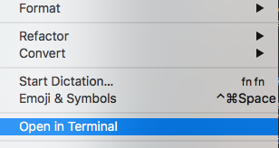

# Open In Terminal - Xcode plugin

A simple and handy plugin that adds an `Open In Terminal` command to `Edit` menu. This command will open the current project **root** folder on Terminal app.

### Why

Because I do a lot of work on terminal, firing git commands and [Fastlane](https://fastlane.tools) automation stuff, so I do not need to spend my fingers time looking for the right place.

### Prerequisites

- Xcode 7+

### Install

Just clone this project, build it (**⌘+B**), then restart Xcode.

At this point you should have an `Open in Terminal` item in your Edit Menu like the screenshot above.

### Uninstall

Run `rm -r ~/Library/Application\ Support/Developer/Shared/Xcode/Plug-ins/OpenInTerminal.xcplugin`, then restart Xcode.

That's it!

--

 Licensed under <a rel="license" href="http://creativecommons.org/licenses/by-nc/4.0/">Creative Commons Non Comercial 4.0 Internacional</a>.
